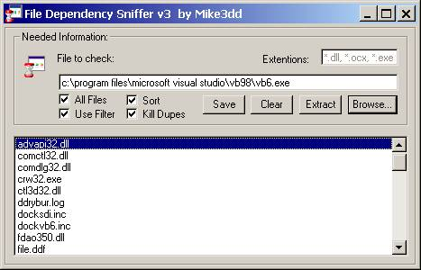



## File Dependency Sniffer v3\! \[MUST SEE\!\]

### Description

(

----

Another Big Update, v3 now... I added a 'All Files' (*.*) scan to it so you can see Every File found in an EXE!!! It also sorta the listbox alphabetically! Check It Out!)(

----

Updated!!! v2, Calling it v2 cause of the major changes i made to the project including a working filtering scheme that correctly fixes the found filenames correctly as far as i can tell... tell me what u think of this new version!)(

----

Updated!, Now has a Search Query box feature so you can search for more than one file extention at once! I also included 2 filtering loops to remove bogus findings, but since it is untested fully i left the original project in the zip for you to have regardless... Check it out.)(***Updated, removes dupes now cause some programs have a reoccuring file being found in the search, so i gave the option to remove dupes or not, check screenshot!)(**Updated, I just fixed the VB5 InstrRev part, sorry if it didn't work..)(*Updated, Just added a save feature to it for developers who want to include it in a readme or something, good luck) Description: I needed a file dependency sniffing program really quick for a friend who sent me a Borland exe and needed to know which dlls it needed so I ran to PSC to find my self searching for keywords and not get anything, then I tried one word and kept browsing through the many entries of PSC. Then I came accross one, called nFile_Search, it was so pathetic I could have cried, the only thing i liked was the interface so I kept it for this program, heh, but I cleared the whole form of code and wrote this up and made it so you can search for other types of files besides .dlls, to expand its usability (.ocx, .exe, @ for emails, anything) so enjoy and if anyone out there has tips or ideas to make it more effecient then please submit. Also please vote if it isnt too much trouble ;p IM me at: Mike3dd Email: MikeCanejo@hotmail.com for anything. ;]
 
### More Info
 
A executable (any file actually)

Files needed to make it run.

             |
---                |---
**Submitted On**   |2002-02-27 04:40:58
**By**             |[Michael L\. Canejo](https://github.com/Planet-Source-Code/PSCIndex/blob/master/ByAuthor/michael-l-canejo.md)
**Level**          |Beginner
**User Rating**    |5.0 (119 globes from 24 users)
**Compatibility**  |VB 5\.0, VB 6\.0
**Category**       |[Files/ File Controls/ Input/ Output](https://github.com/Planet-Source-Code/PSCIndex/blob/master/ByCategory/files-file-controls-input-output__1-3.md)
**World**          |[Visual Basic](https://github.com/Planet-Source-Code/PSCIndex/blob/master/ByWorld/visual-basic.md)
**Archive File**   |[File\_Depen579422272002\.zip](https://github.com/Planet-Source-Code/michael-l-canejo-file-dependency-sniffer-v3-must-see__1-31828/archive/master.zip)

